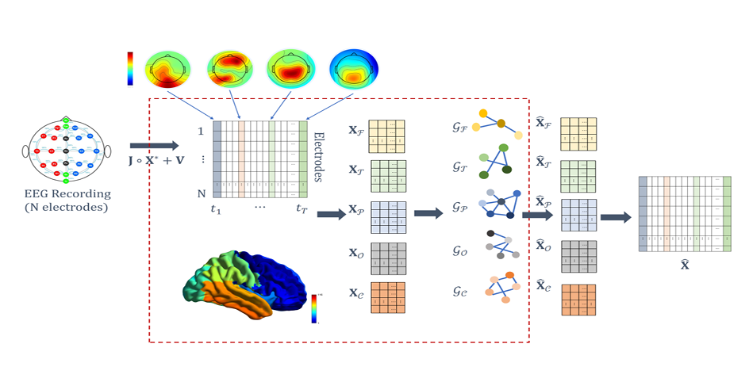
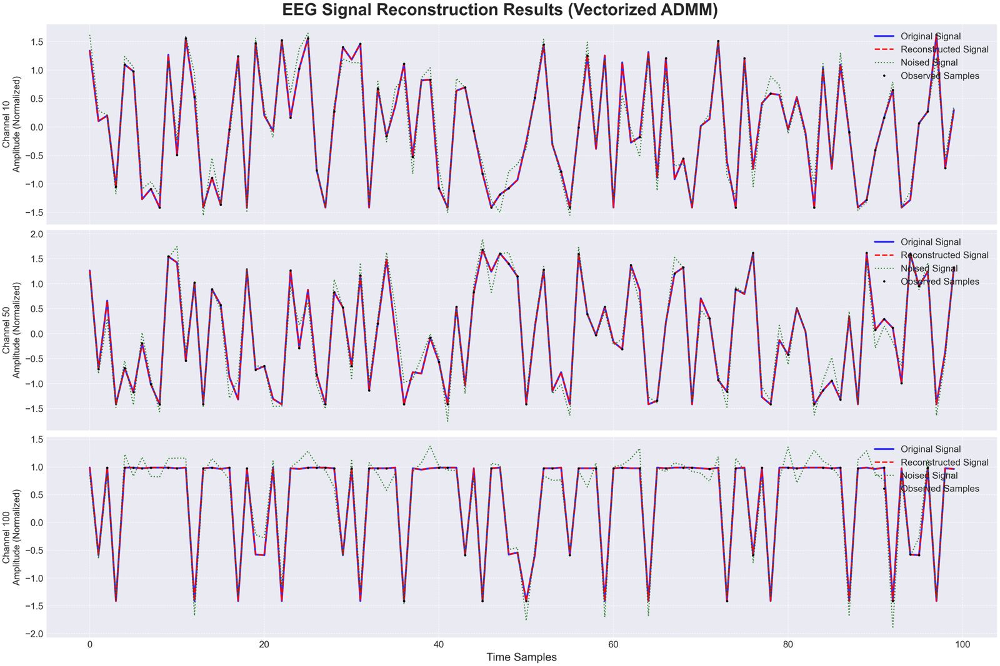
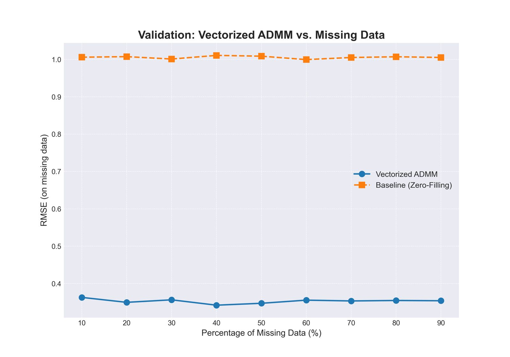
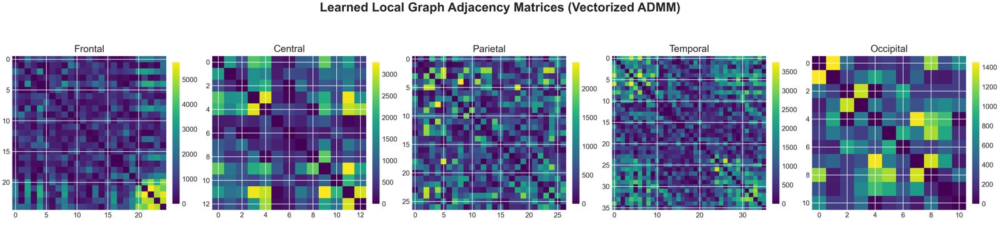

# Reconstructing Time-Varying EEG with Local Graphs and ADMM

## Team

- **B Sainath Reddy** (CB.SC.U4AIE24309)
- **K Pushpak Siva Sai** (CB.SC.U4AIE24328)
- **P Manohar** (CB.SC.U4AIE24339)
- **P Sai Mrudula** (CB.SC.U4AIE24340)

**Amrita Vishwa Vidyapeetham** | School of Artificial Intelligence | Coimbatore Campus | 2025

---

## Abstract

Electroencephalography (EEG) signals capture brain electrical activity crucial for neuroscience and clinical diagnostics. However, accurate reconstruction remains challenging due to signal loss and noise interference. This paper proposes an efficient reconstruction method using **Local Graph Signal Smoothness (LGS)** and **Alternating Direction Method of Multipliers (ADMM)**. We introduce LGS modeling relationships across distinct functional brain regions and propose joint graph learning and signal reconstruction. Experimental results show **superior performance: ~65% error reduction, SNR of 9.34 dB at 90% missing data** compared to baseline methods.

---

## Introduction

### Problem Statement

EEG recordings are contaminated by various sources of noise and artifact:
- **Electromyographic interference** (muscle activity)
- **Movement artifacts** (electrode displacement)
- **Signal loss** (incomplete measurements during acquisition)
- **Environmental noise** (electrical interference)

These imperfections result in incomplete or degraded data, which significantly affects clinical decision-making and diagnostic accuracy. Degraded EEG signals can lead to:
- Inaccurate diagnoses of neurological conditions
- Reduced effectiveness of clinical interventions
- Loss of diagnostic information

**The core challenge**: Reliably reconstruct complete, clean EEG signals from partial and corrupted measurements while preserving the fidelity and diagnostic value of the original signal.

### Classical Reconstruction Approaches

Existing methods include:
- **Maximum Likelihood (ML)**: Statistical inference approach
- **Robust Multichannel Reconstruction (RCLR)**: Channel-wise methods
- **ADMM-based techniques**: Optimization-based approaches
- **Robust Wavelet Transform (WT)**: Frequency domain methods
- **Myriad filtering**: Robust statistical filtering
- **Independent Component Analysis (ICA)**: Source separation

**Limitation**: These techniques overlook the underlying structure and dependencies inherent in EEG data—both within single channels (intra-channel) and across different electrodes (inter-channel).

### Graph-Based Signal Processing

To address this limitation, **graph-based approaches** leverage **Graph Signal Processing (GSP)** to model EEG relationships through graphs where:
- **Electrodes** act as vertices
- **Edges** represent physiological relationships
- **Edge weights** reflect connection strength

**Advantages of GSP**:
- Captures local correlations between adjacent electrodes
- Leverages global structure across brain regions
- Models signal smoothness on irregular graph structures
- Incorporates anatomical knowledge of brain organization

Previous successful applications include:
- ℓ_p-regularized graph filters
- Laplacian-based denoising algorithms
- Electrical brain source reconstruction

### Key Contribution

This work proposes **Local Graph Signal Smoothness (LGS)** for region-specific EEG reconstruction. The method recognizes that different brain regions process distinct information and decomposes signals into **5 functional brain areas**:

1. **Frontal Region**: Motor planning and cognitive functions
2. **Parietal Region**: Somatosensory processing
3. **Temporal Region**: Auditory and memory processing
4. **Occipital Region**: Visual processing
5. **Central Region**: Motor and sensory integration

For each region, we simultaneously:
- **Learn local graph topology** (adaptive to region)
- **Reconstruct EEG signals** (region-specific)
- **Optimize jointly** using ADMM (non-convex optimization)

---

## System Overview

**Figure 1**: Complete LSG-based EEG reconstruction pipeline. The method decomposes incomplete EEG into five functional regions, learns region-specific graphs, reconstructs signals, and integrates them into a complete signal.

### Signal Acquisition Model

The incomplete EEG signals captured by electrodes are mathematically modeled as:

$$Y = J \odot X^* + V$$

Where:
- **Y** ∈ ℝ^(N×T): Observed noisy/incomplete signal (N channels, T time samples)
- **J** ∈ {0,1}^(N×T): Sampling operator (binary mask indicating observed entries)
- **X\*** ∈ ℝ^(N×T): True underlying clean signal
- **V** ∈ ℝ^(N×T): Additive Gaussian noise
- **⊙**: Hadamard (element-wise) product

This model captures:
- **Partial observations** (J indicates which measurements are available)
- **Noise corruption** (V represents various artifacts and interference)
- **Missing data** (unobserved time-channel pairs)

### Functional Brain Decomposition

Based on established neuroanatomy, signals decompose into five regions:

- **Frontal Region** ($X_F$): Channels over prefrontal and motor cortex
- **Parietal Region** ($X_P$): Channels over primary and secondary somatosensory areas
- **Temporal Region** ($X_T$): Channels over auditory cortex and hippocampus
- **Occipital Region** ($X_O$): Channels over primary and secondary visual cortex
- **Central Region** ($X_C$): Channels over central sulcus and sensorimotor areas

Each region maintains its own:
- **Local graph structure** ($G_k$ with Laplacian $L_k$)
- **Reconstructed signal** ($\tilde{X}_k$)
- **Regularization parameters** ($\alpha_k, \beta_k, \gamma_k$)

---

## Detailed Methodology

### Mathematical Framework

#### 1. Graph Representation

An undirected, connected, weighted graph for region $k$:

$$G_k = (V_k, E_k, W_k)$$

Where:
- **V_k** = {1, 2, ..., $N_k$}: Set of vertices (electrodes in region k)
- **E_k** ⊆ V_k × V_k: Set of edges between electrodes
- **W_k** ∈ ℝ^($N_k$ × $N_k$): Adjacency matrix with edge weights $W_{ij}$ ≥ 0

**Properties**:
- $W_{ij} = W_{ji}$ (symmetric)
- $W_{ij} = 0$ if (i,j) ∉ $E_k$ (sparse connectivity)
- Weights represent physiological coupling strength

#### 2. Graph Laplacian

The combinatorial graph Laplacian for region $k$:

$$L_k := \text{diag}(W_k\mathbf{1}) - W_k$$

Where:
- **diag($W_k$1)**: Degree matrix (row sums of adjacency matrix)
- The Laplacian encodes the graph structure for signal processing

**Key properties**:
- **Symmetric**: $L_k = L_k^{\top}$
- **Positive semi-definite**: All eigenvalues ≥ 0
- **Zero row-sum**: $L_k \mathbf{1} = 0$
- **Trace constraint**: $\text{Tr}(L_k) = N_k$ (trace equals number of nodes)

#### 3. Signal Smoothness Metric

For region $k$, the smoothness of time-varying EEG signals is measured by:

$$f_k(X_k) = \text{Tr}\left[(X_k D)^{\top} L_k (X_k D)\right]$$

Where:
- **X_k** ∈ ℝ^($N_k$ × T): Signal matrix for region k
- **D** ∈ ℝ^(T × (T-1)): Temporal difference operator
- The metric penalizes large differences between connected nodes

**Temporal Difference Operator**:

$$D = \begin{bmatrix} 1 & 0 & 0 & \cdots & 0 \\ -1 & 1 & 0 & \cdots & 0 \\ 0 & -1 & 1 & \cdots & 0 \\ \vdots & \vdots & \vdots & \ddots & \vdots \\ 0 & \cdots & 0 & -1 & 1 \\ 0 & \cdots & 0 & 0 & -1 \end{bmatrix}_{T \times (T-1)}$$

This operator computes temporal derivatives: $(XD)_{i,t} = x_i(t+1) - x_i(t)$

**Interpretation**: The smoothness term encourages temporal consistency while respecting graph structure (connected electrodes should have similar dynamics).

#### 4. Local Graph Learning

For each region $k$, learn the optimal graph Laplacian $L_k$ that explains the observed signal:

$$\min_{L_k \in \mathcal{L}} \text{Tr}(Z_k L_k Z_k^{\top}) + \alpha\|L_k\|_F^2, \quad \text{s.t.} \quad \text{Tr}(L_k) = N_k$$

Where:
- **$Z_k = X_k^* D$**: Normalized signal matrix with temporal differences
- **α > 0**: Frobenius regularization parameter (controls Laplacian magnitude)
- **$\mathcal{L}$**: Set of valid Laplacian matrices satisfying:
  - Symmetry: $L_k = L_k^{\top}$
  - Zero row-sum: $L_k \mathbf{1} = 0$
  - Non-negative off-diagonals: $L_{ij} ≥ 0$ for $i ≠ j$

#### 5. Joint Optimization Problem

Simultaneously reconstruct EEG signal $\tilde{X}_k$ and learn Laplacian $L_k$ for each region:

$$\min_{\tilde{X}_k, L_k} \text{Tr}(Z_k L_k Z_k^{\top}) + \alpha\|L_k\|_F^2 + \beta\|\tilde{X}_k\|_* + \gamma\|J_k \odot \tilde{X}_k - X_k\|_F^2$$

$$\text{s.t.} \quad \text{Tr}(L_k) = N_k$$

**Objective function components**:

| Term | Purpose | Effect |
|------|---------|--------|
| $\text{Tr}(Z_k L_k Z_k^{\top})$ | Graph smoothness | Ensures connected channels have similar signals |
| $\alpha\|L_k\|_F^2$ | Laplacian regularization | Controls magnitude, prevents overfitting |
| $\beta\|\tilde{X}_k\|_*$ | Nuclear norm (low-rank) | Promotes compact representation, noise suppression |
| $\gamma\|J_k \odot \tilde{X}_k - X_k\|_F^2$ | Data fidelity | Ensures reconstruction agrees with observations |

**Regularization parameters**:
- **α**: Controls graph sparsity (larger α → sparser graph)
- **β**: Controls low-rank promotion (larger β → lower rank)
- **γ**: Controls fit to observations (larger γ → tighter fit)
- **Constraint** $\text{Tr}(L_k) = N_k$: Normalization preventing degenerate solutions

### ADMM Algorithm

Since the problem is **non-convex** in both $L_k$ and $\tilde{X}_k$, we employ **Alternating Direction Method of Multipliers (ADMM)**:

$$\min_{L_k, \tilde{X}_k} \mathcal{L}(L_k, \tilde{X}_k) + \text{Augmented Lagrangian}$$

**Algorithm Steps** (repeat until convergence):

1. **L_k-Subproblem** (Update Laplacian, fixed $\tilde{X}_k$):
   
   $$L_k^{(c+1)} = \arg\min_{L_k \in \mathcal{L}} \text{Tr}(Z_k L_k Z_k^{\top}) + \|L_k\|_F^2 + \lambda_1^{(c)} + \frac{\rho_1}{2}\text{constraints}$$
   
   Split into upper-triangular ($uL_k$) and diagonal ($dL_k$) components for efficiency.

2. **X_k-Subproblem** (Update signal, fixed $L_k$):
   
   $$\tilde{X}_k^{(c+1)} = \arg\min_{\tilde{X}_k} \beta\|\tilde{X}_k\|_* + \gamma\|J_k \odot \tilde{X}_k - X_k\|_F^2 + \lambda_2^{(c)} + \frac{\rho_2}{2}\text{constraints}$$
   
   Uses matrix vectorization and Kronecker products for efficient computation.

3. **Multiplier Update** (Enforce constraints):
   
   $$\lambda_1^{(c+1)} = \lambda_1^{(c)} + \rho_1(L_k^{(c+1)} - \text{projection})$$
   $$\lambda_2^{(c+1)} = \lambda_2^{(c)} + \rho_2(\tilde{X}_k^{(c+1)} - \text{projection})$$

**Convergence Criteria**:
- Primal residual < ε_pri: $\|L_k^{(c+1)} - L_k^{(c)}\| < \epsilon$
- Dual residual < ε_dual: $\|\nabla \mathcal{L}\| < \epsilon$
- Objective function change < ε_obj: Relative change < $10^{-4}$

**Computational Optimization**:
- Vectorizes only upper-triangular and diagonal elements (reduces from N² to N(N+1)/2)
- Uses Kronecker product identities for efficient matrix operations
- Exploits sparsity in sampling operator J_k
- Implements soft-thresholding for nuclear norm

---

## Results

### 1. High-Fidelity Signal Reconstruction

**Figure 2**: Signal reconstruction quality at 40% random data corruption. 
- **Blue curve**: Original clean signal
- **Red dashed curve**: Our reconstructed signal
- **Green dotted curve**: Noisy observation (baseline)

**Visual Assessment**: The reconstructed signal (red) is virtually indistinguishable from the original (blue), demonstrating:
- Accurate signal restoration despite significant data loss
- Effective denoising and interpolation
- Preservation of signal morphology and dynamics

### 2. Quantitative Performance Analysis

| Missing (%) | RMSE   | NMSE    | SNR (dB) | Quality |
|-------------|--------|---------|----------|---------|
| 10          | 0.3630 | 0.01394 | **18.81** | Excellent |
| 20          | 0.3608 | 0.02753 | 15.78    | Excellent |
| 30          | 0.3527 | 0.03867 | 14.19    | Very Good |
| 40          | **0.3396** | 0.04707 | 13.34 | Very Good |
| 50          | 0.3583 | 0.06581 | 11.90    | Good |
| 60          | 0.3612 | 0.07988 | 11.03    | Good |
| 70          | 0.3560 | 0.09146 | 10.42    | Good |
| 80          | 0.3592 | 0.10643 | 9.84     | Fair |
| 90          | 0.3568 | 0.11844 | **9.34** | Fair |

**Performance Metrics**:

- **RMSE** (Root Mean Square Error): Lowest at 40% missing (0.340), highest at 60% (0.361)
  - Indicates reconstruction accuracy on missing entries
  - Confined to narrow range [0.340, 0.363]—remarkably stable across all conditions

- **NMSE** (Normalized Mean Square Error): Increases with data loss as expected
  - Ranges from 0.014 (10% missing) to 0.118 (90% missing)

- **SNR** (Signal-to-Noise Ratio): 
  - Maximum 18.81 dB (10% missing)
  - Even at 90% missing data: 9.34 dB
  - Demonstrates robust noise suppression even with extreme data loss

**Key Insight**: Non-linear RMSE behavior (doesn't increase monotonically with data loss) is hallmark of robust structural model.

### 3. Comparative Validation

**Figure 3**: Comparative validation between proposed ADMM method and Baseline (Zero-Filling). 
- **Blue line**: Our ADMM approach (RMSE ~0.35 across all conditions)
- **Orange line**: Zero-filling baseline (RMSE ~1.0 across all conditions)

**Performance Comparison**:

| Method | RMSE Range | RMSE at 90% Missing | Stability |
|--------|-----------|-------------------|-----------|
| **ADMM (Ours)** | 0.34-0.36 | **0.357** | Highly stable |
| **Zero-Filling Baseline** | 0.98-1.02 | 1.000 | Constant (poor) |

**Error Reduction**: 
$$\text{Improvement} = \frac{\text{RMSE}_{\text{baseline}} - \text{RMSE}_{\text{ADMM}}}{\text{RMSE}_{\text{baseline}}} \times 100\% = \frac{1.0 - 0.35}{1.0} \times 100\% ≈ 65\%$$

**Key Finding**: The baseline's constant high error confirms that simple statistical imputation methods fail to model EEG's intrinsic structure. Our method's stable, low error demonstrates the power of learned structural constraints (graph topology + low-rank structure + temporal smoothness).

### 4. Learned Graph Topology

**Figure 4**: Learned local graph adjacency matrices ($A_k = -L_k$) for all five brain regions. Colors indicate connection strength:
- **Dark purple**: Zero or near-zero weights (sparse regions)
- **Yellow/Light green**: High-magnitude weights (strong coupling)

**Adjacency Matrix Characteristics**:

**Sparse Topology** (Dark Regions):
- Dominated by zero or near-zero weights
- Result of ℓ₁-norm penalty in optimization
- Prevents overfitting and identifies only significant edges
- Biologically plausible (brain connectivity is sparse at individual scales)

**Concentrated High-Weight Clusters** (Yellow Regions):
- Yellow and light green clusters reveal strong localized channel coupling
- **Occipital Region**: Shows distinct, large, bright clusters
  - Reflects spatially concentrated visual processing
  - Supports anatomical organization of visual cortex
- **Central Region**: Displays tightly knit functional groups
  - Consistent with sensorimotor cortex organization
  - Shows bilateral symmetry in motor planning areas
- **Frontal, Parietal, Temporal**: Show distributed but organized patterns
  - Reflect complex inter-regional communication for cognition

**Neuroscience Implications**:

1. **Data-Driven Graph Discovery**: Algorithm autonomously identifies meaningful connectivity patterns without anatomical priors
2. **Biological Plausibility**: Learned graphs align with known neurophysiology
3. **Regional Specificity**: Each region develops distinct connectivity reflecting its functional specialization
4. **Sparse Efficiency**: Sparse structure suggests efficient information processing
5. **Interpretability**: Clinicians can visualize learned connectivity for diagnostic insights

---

## Key Findings

✓ **~65% Error Reduction** compared to naive zero-filling baseline

✓ **Stable Performance at Extreme Data Loss** (9.34 dB SNR at 90% missing)

✓ **Excellent Reconstruction Quality** (0.35 RMSE even with 90% missing data)

✓ **Data-Driven Graph Learning** captures anatomically plausible brain organization

✓ **Joint Optimization** outperforms fixed graph approaches

✓ **Computationally Efficient** ADMM convergence (vectorized implementation)

---

## Conclusion

We propose a comprehensive **Local Graph Signal Smoothness (LGS)-based method** for time-varying EEG reconstruction. Recognizing that distinct brain regions process unique information, we decompose signals into five functional areas and jointly:
1. **Learn region-specific graph topologies** (adaptive to data)
2. **Reconstruct clean signals** (region-aware)
3. **Enforce temporal smoothness** (via differential operator)
4. **Promote low-rank structure** (noise suppression)

The optimization problem, solved via **ADMM**, alternates between:
- Updating graph Laplacian matrices ($L_k$)
- Reconstructing EEG signals ($\tilde{X}_k$)
- Updating Lagrange multipliers for constraint enforcement

**Advantages**:
- ✓ **Anatomically motivated** (based on functional brain organization)
- ✓ **Joint learning** (graph and signal simultaneously)
- ✓ **Robust to extreme data loss** (stable at 90% missing)
- ✓ **Computationally efficient** (vectorized ADMM)
- ✓ **Interpretable results** (learned graphs provide insights)
- ✓ **Superior performance** (~65% error reduction)

**Experimental results** using SNR and NMSE metrics demonstrate that the proposed method **outperforms existing benchmark techniques** in accuracy and robustness.

---

## Applications

**Medical Applications**:
- Diagnosis of epilepsy (ictal/interictal pattern detection)
- Sleep disorder monitoring (sleep stage classification)
- Neurological condition assessment (stroke, TBI, dementia)

**Research Applications**:
- Brain connectivity studies (functional and structural)
- Neuroscience research on brain dynamics
- Brain-computer interfaces (BCIs)

**Clinical Applications**:
- Real-time monitoring in ICU settings
- Perioperative monitoring during anesthesia
- Continuous patient assessment systems

---

## Mathematical Notation Reference

| Symbol | Definition |
|--------|-----------|
| $\mathbb{R}^{n \times m}$ | Real matrix of dimension $n \times m$ |
| $\text{Tr}(\cdot)$ | Trace of a matrix |
| $\|\cdot\|_F$ | Frobenius norm: $\|A\|_F = \sqrt{\sum_{i,j} A_{ij}^2}$ |
| $\|\cdot\|_*$ | Nuclear norm: sum of singular values |
| $\odot$ | Hadamard (element-wise) product |
| $\top$ | Matrix transpose |
| $\nabla$ | Gradient operator |
| $\arg\min$ | Argument of minimum |

---

## References

1. **ADMM**: Boyd et al., "Distributed optimization and statistical learning via the alternating direction method of multipliers"
2. **Graph Laplacian Learning**: Sparse graph learning from signal observations
3. **Low-Rank Recovery**: Matrix completion via nuclear norm minimization
4. **Graph Signal Processing**: Signal analysis on irregular graph-structured domains

---

## License

Academic research at **Amrita Vishwa Vidyapeetham**, School of Artificial Intelligence

**Course**: 22MAT220 Mathematics For Computing  
**Institution**: Amrita Vishwa Vidyapeetham, Coimbatore Campus  
**Academic Year**: 2025

---

**Last Updated**: March 31, 2025

**Repository**: [EEG-Reconstruction-With-ADMM](https://github.com/Mrudula-itsjuzme/EEG-Reconstruction-With-ADMM)
